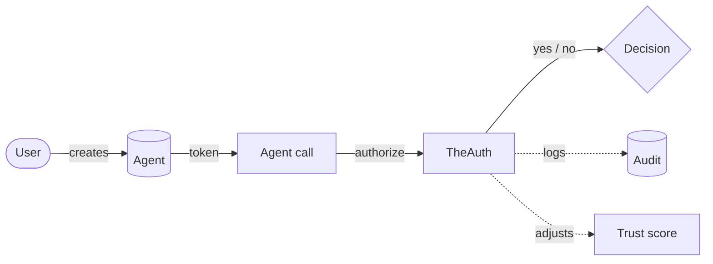

# Core Concepts

A TheAuth app has one loop: a user signs in, creates agents, agents call `authorize()` before acting, and every decision lands in the audit trail. Everything else is detail on top of that loop.



## User vs agent

A **user** is a human. They have email, password, sessions, OAuth accounts. TheAuth can run human auth for you (see the [auth guides](../guides/auth/email-password.md)) or plug into Clerk, Auth.js, better-auth.

An **agent** is a program acting on a user's behalf. One human can own many agents. Agents do not sign in. They authenticate with a bearer token (`kv_...`) that is issued once and hashed at rest. No password, no session, no OAuth.

!!! info
    If you reach for password reset, email verification, or social sign-in on an agent, you want a user, not an agent. Agents are non-interactive by design.

## Permission model

Permissions are structured objects that describe what the agent may do, scoped to resources it may touch.

```ts
permissions: [
  {
    resource: 'mcp:github:*',        // wildcard on tool namespaces
    actions: ['read'],
    constraints: {
      maxCallsPerHour: 100,          // rate limit
      requireApproval: true,         // human-in-the-loop gate
      ipAllowlist: ['10.0.0.0/8'],   // where the agent may run from
      timeWindow: { start: '09:00', end: '18:00' },
    },
  },
]
```

Three shapes carry most of the real work:

- The **resource string** (free-form, convention-driven, usually `kind:namespace:id`)
- The **action list** (`read`, `write`, `execute`, domain-specific verbs)
- **Constraints** (rate, approval, IP, time, argument patterns)

`authorize()` evaluates all three in memory.

!!! tip
    Resource strings are conventions, not enforced syntax. Pick `mcp:github:*`, `db:users:write`, `s3:bucket:objects`, whatever reads in logs. Consistency matters more than syntax.

## Delegation

An agent can hand a subset of its permissions to a sub-agent. Every hop carries a depth counter, an expiry, and can be revoked independently. Revocation cascades: revoke the parent, every delegated child loses its permissions the next time it calls `authorize()`.

```ts
await kavach.delegate({
  fromAgent: parent.id,
  toAgent: sub.id,
  permissions: [{ resource: 'mcp:github:issues', actions: ['read'] }],
  expiresAt: new Date(Date.now() + 3_600_000),
  maxDepth: 2,
});
```

## Audit trail

Every `authorize()` call writes an entry to `kavach_audit_logs`. The log is append-only. Entries record agent ID, user ID, resource, action, result (`allowed`, `denied`, `rate_limited`), duration, and timestamp.

The `auditId` returned by `authorize()` links the decision to its log entry.

## Trust scoring

Each agent has a TrustScore: a 0-100 number computed from the audit log. New agents start at 50. Successful calls raise the score; denials and anomalies lower it. The score maps to five named levels:

| Score range | Level |
|---|---|
| 0-19 | `untrusted` |
| 20-39 | `limited` |
| 40-59 | `standard` |
| 60-79 | `trusted` |
| 80-100 | `elevated` |

Scores are computed from the audit log, not self-reported. An agent cannot give itself a higher score.

## MCP OAuth 2.1

TheAuth implements the full MCP auth stack: OAuth 2.1 with PKCE (S256), Protected Resource Metadata (RFC 9728), Authorization Server Metadata (RFC 8414), Resource Indicators (RFC 8707), and Dynamic Client Registration (RFC 7591).

Enable it by passing `mcp: { enabled: true, issuer: '...' }` to `createKavach`.

## Related pages

- [Agent Identity](agents.md)
- [Sessions](sessions.md)
- [Delegation](delegation.md)
- [Trust Scoring](trust-scoring.md)
- [MCP Authorization](mcp-authorization.md)
- [Standards Alignment](standards.md)
