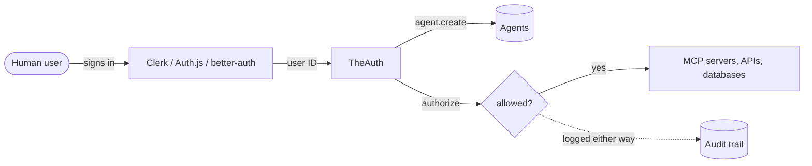

# TheAuth

**Auth for AI agents.** TheAuth gives every agent its own identity, checks permissions at call time, and writes an audit row for every decision. Plugs in after your human auth (Clerk, Auth.js, better-auth, or your own). Runs on Node, edge, Workers, Deno, and Bun.

```ts
import { createTheAuth } from '@glinr/theauth';

const kavach = await createTheAuth({
  database: { provider: 'sqlite', url: 'kavach.db' },
});

const agent = await kavach.agent.create({
  ownerId: user.id,
  name: 'code-reviewer',
  type: 'autonomous',
  permissions: [
    { resource: 'mcp:github:*', actions: ['read'] },
  ],
});

const { allowed, auditId } = await kavach.authorize(agent.id, {
  action: 'read',
  resource: 'mcp:github:repos',
});
```

## Install

=== "pnpm"
    ```bash
    pnpm add @glinr/theauth
    ```
=== "npm"
    ```bash
    npm install @glinr/theauth
    ```
=== "yarn"
    ```bash
    yarn add @glinr/theauth
    ```
=== "bun"
    ```bash
    bun add @glinr/theauth
    ```

## What is in the box

| Capability | Description |
|---|---|
| Agent identity | First-class entity with bearer tokens (`kv_...`), rotation, and expiry. SHA-256 hashed at rest. |
| Permission engine | Resource wildcards, rate limits, time windows, IP allowlists, approval gates. |
| Delegation chains | Orchestrator delegates a subset to a sub-agent with depth and expiry. Revocation cascades. |
| Append-only audit | Every `authorize()` writes agent, user, resource, action, result, duration. |
| MCP OAuth 2.1 | Spec-compliant authorization server with PKCE S256, RFC 9728, RFC 7591. |
| Trust scoring | Nine-factor score per agent. Anomaly detection and budget policies on top. |
| Framework adapters | Ten adapters for Node, edge, Workers, Deno, Bun. |
| Database support | SQLite, Postgres, MySQL, Cloudflare D1. |
| Web Crypto only | No Node-specific APIs in core. Runs on any runtime. |

## How it fits your stack



!!! info "TheAuth does not replace your human auth"
    It does not handle login forms, password resets, or social OAuth for users. It starts where human auth ends: at the point your product spins up an agent to act on a user's behalf.

## Pick your framework

| Framework | Package | Mount pattern |
|---|---|---|
| [Next.js](guides/frameworks/nextjs.md) | `@glinr/theauth-nextjs` | catch-all App Router route |
| [Hono](guides/frameworks/hono.md) | `@glinr/theauth-hono` | `app.route('/api/kavach', ...)` |
| [Express](guides/frameworks/express.md) | `@glinr/theauth-express` | `app.use('/api/kavach', ...)` |
| [Fastify](guides/frameworks/fastify.md) | `@glinr/theauth-fastify` | plugin registration |
| [NestJS](guides/frameworks/nestjs.md) | `@glinr/theauth-nestjs` | guards and decorators |
| [Nuxt](guides/frameworks/nuxt.md) | `@glinr/theauth-nuxt` | catch-all server route |
| [SvelteKit](guides/frameworks/sveltekit.md) | `@glinr/theauth-sveltekit` | hooks and catch-all |
| [Astro](guides/frameworks/astro.md) | `@glinr/theauth-astro` | catch-all server page |

## Next steps

- [Quick Start](getting-started/quick-start.md) - Agent in five minutes.
- [Core Concepts](concepts/core-concepts.md) - The mental model before touching code.
- [MCP Authorization](concepts/mcp-authorization.md) - OAuth 2.1 for Model Context Protocol.
- [Database Setup](guides/database.md) - SQLite, Postgres, MySQL, D1.
- [Migrate from better-auth](migrations/from-better-auth.md) - Concepts map, code diffs, SQL.
- [Migrate from Clerk](migrations/from-clerk.md) - Hooks, middleware, data export.
