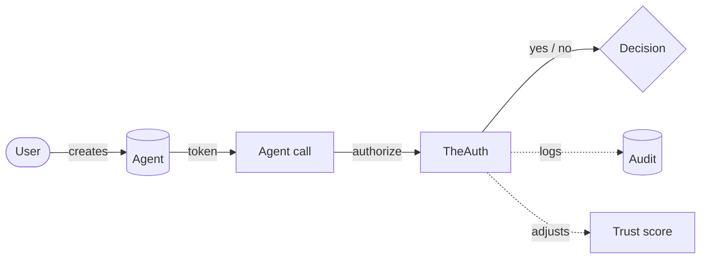

A TheAuth app has one loop: a user signs in, creates agents, agents call `authorize()` before acting, and every decision lands in the audit trail. Everything else is detail on top of that loop.



## User vs agent

A **user** is a human. They have email, password, sessions, OAuth accounts. Kavach can run human auth for you (see [Authentication](/auth)) or plug into Clerk, Auth.js, better-auth.

An **agent** is a program acting on a user's behalf. One human can own many agents. Agents do not sign in. They authenticate with a bearer token (`kv_...`) that is issued once and hashed at rest. No password, no session, no OAuth.

<Info>
If you reach for password reset, email verification, or social sign-in on an agent, you want a user, not an agent. Agents are non-interactive by design.
</Info>

## Permission model

Permissions are strings that describe what the agent may do, scoped to resources it may touch.

```ts
permissions: [
  {
    resource: 'mcp:github:*',        // wildcard on tool namespaces
    actions: ['read'],
    constraints: {
      maxCallsPerHour: 100,          // rate limit
      requireApproval: true,         // human-in-the-loop gate
      ipAllowlist: ['10.0.0.0/8'],   // where the agent may run from
      timeWindow: { start: '09:00', end: '18:00' },
    },
  },
]
```

Three shapes carry most of the real work: the **resource string** (free-form, convention-driven, usually `kind:namespace:id`), the **action list** (`read`, `write`, `execute`, domain-specific verbs), and **constraints** (rate, approval, IP, time, argument patterns). `authorize()` evaluates all three in memory.

<Tip>
Resource strings are conventions, not enforced syntax. Pick `mcp:github:*`, `db:users:write`, `s3:bucket:objects`, whatever reads in logs. Consistency matters more than syntax.
</Tip>

## Delegation

An agent can hand a subset of its permissions to a sub-agent. Every hop carries a depth counter, an expiry, and can be revoked independently. Revocation cascades: revoke the parent, every delegated child loses its permissions the next time it calls `authorize()`.

```ts
await kavach.delegate({
  fromAgent: parent.id,
  toAgent: child.id,
  permissions: [{ resource: 'mcp:github:issues', actions: ['read'] }],
  expiresAt: new Date(Date.now() + 3_600_000),
  maxDepth: 2,
});
```

An agent cannot delegate permissions it does not hold. Attempts to escalate are rejected at delegation time, not at the next `authorize()` call. That keeps the audit log clean.

## Audit trail

Every `authorize()` writes one row:

| Field | Meaning |
|---|---|
| `agentId` | Which agent asked |
| `userId` | The human the agent belongs to |
| `action`, `resource` | What they tried to do |
| `result` | `allowed` or `denied` |
| `reason` | Why, if denied |
| `duration` | Evaluation latency in ms |
| `constraints` | Which constraints fired |
| `delegationChain` | Full parent chain if the agent was delegated |

The trail is append-only. Export as JSON or CSV for compliance, or stream via webhooks.

## Agent types

<AccordionGroup>
  <Accordion title="autonomous" icon="robot">
    Acts on its own. No human approval unless a permission constraint says so. Background jobs, cron, assistants that run unattended.
  </Accordion>
  <Accordion title="delegated" icon="link">
    Gets permissions from a parent agent via delegation. Use for ephemeral sub-agents created to finish one task, then discarded.
  </Accordion>
  <Accordion title="service" icon="server">
    Long-lived infrastructure identity. MCP servers, internal microservices, anything service-account-shaped.
  </Accordion>
</AccordionGroup>

## Trust scoring

Every agent carries a score from 0 to 100, recomputed on each `authorize()` call. Nine factors feed it: attestation strength, delegation depth, behavioral anomaly, geolocation stability, rate of denials, age, owner trust, workload binding presence, runtime attestation.

The score maps to a tier used in policy templates: `unverified` (0-19), `low` (20-39), `standard` (40-59), `elevated` (60-79), `high` (80+).

See [Trust scoring](/trust) for the full formula and [Policy templates](/policies/templates) for policies keyed off the tier.

## MCP OAuth

TheAuth ships an OAuth 2.1 authorization server for Model Context Protocol tool servers. Your MCP servers register as OAuth clients, your agents get scoped access tokens, and TheAuth audits every tool call with the same `authorize()` loop.

Three relevant standards: **PKCE S256** (RFC 7636), **Protected Resource Metadata** (RFC 9728), **Dynamic Client Registration** (RFC 7591). Full details in [MCP OAuth 2.1](/mcp).

## What to read next

<CardGroup cols={2}>
  <Card title="Quickstart" icon="rocket" href="/quickstart">
    Five minutes to a working agent.
  </Card>
  <Card title="Add to an existing app" icon="screwdriver-wrench" href="/add-to-existing-app">
    Drop Kavach next to Clerk, Auth.js, or better-auth.
  </Card>
  <Card title="Permissions" icon="shield-halved" href="/permissions">
    Resource strings, constraints, approval gates.
  </Card>
  <Card title="Delegation" icon="link" href="/delegation">
    Chains, depth limits, revocation.
  </Card>
</CardGroup>
