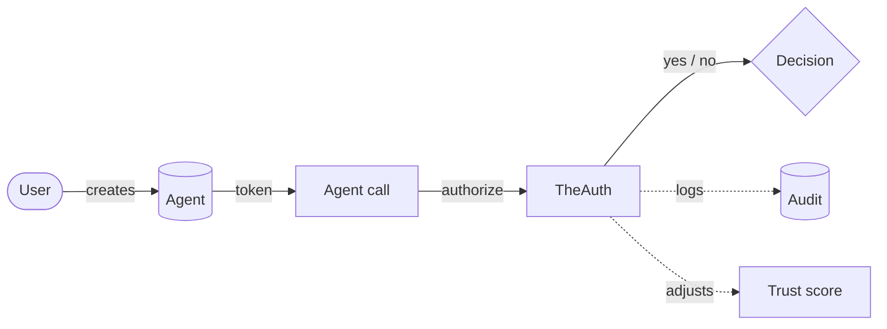

A TheAuth app has one loop: a user signs in, creates agents, agents call `authorize()` before acting, and every decision lands in the audit trail. Everything else is detail on top of that loop.


```mermaid
flowchart LR
  U([User]) -->|creates| A[(Agent)]
  A -->|token| C[Agent call]
  C -->|authorize| K[TheAuth]
  K -->|yes / no| Out{Decision}
  K -.->|logs| Log[(Audit)]
  K -.->|adjusts| T[Trust score]
```

## User vs agent

A **user** is a human. They have email, password, sessions, OAuth accounts. TheAuth can run human auth for you (see [Authentication](/auth)) or plug into Clerk, Auth.js, better-auth.

An **agent** is a program acting on a user's behalf. One human can own many agents. Agents do not sign in. They authenticate with a bearer token (`kv_...`) that is issued once and hashed at rest. No password, no session, no OAuth.

<Info>
If you reach for password reset, email verification, or social sign-in on an agent, you want a user, not an agent. Agents are non-interactive by design.
</Info>

## Permission model

Permissions are strings that describe what the agent may do, scoped to resources it may touch.

```ts
permissions: [
  {
    resource: 'mcp:github:*',        // wildcard on tool namespaces
    actions: ['read'],
    constraints: {
      maxCallsPerHour: 100,          // rate limit
      requireApproval: true,         // authorize() denies until approval is wired up
      ipAllowlist: ['10.0.0.0/8'],   // where the agent may run from
      timeWindow: { start: '09:00', end: '18:00' },  // server local time
    },
  },
]
```

Three shapes carry most of the real work: the **resource string** (free-form, convention-driven, usually `kind:namespace:id`), the **action list** (`read`, `write`, `execute`, domain-specific verbs), and **constraints** (rate, approval, IP, time, argument patterns). `authorize()` evaluates all three. `allowedArgPatterns` are regular expressions, and every string argument must match every pattern.

<Tip>
Resource strings are conventions, not enforced syntax. Pick `mcp:github:*`, `db:users:write`, `s3:bucket:objects`, whatever reads in logs. Consistency matters more than syntax.
</Tip>

## Delegation

An agent can hand a subset of its permissions to a sub-agent. Every hop carries a depth counter, an expiry, and can be revoked independently. Revoking a delegation cascades: every delegation made onward from that link is revoked too, so those agents lose the delegated permissions the next time they call `authorize()`.

```ts
await theauth.delegate({
  fromAgent: parent.id,
  toAgent: child.id,
  permissions: [{ resource: 'mcp:github:issues', actions: ['read'] }],
  expiresAt: new Date(Date.now() + 3_600_000),
  maxDepth: 2,
});
```

An agent cannot delegate permissions it does not hold. Attempts to escalate are rejected at delegation time, not at the next `authorize()` call. `maxDepth` limits chain length: the new link's depth must be less than or equal to it (default 3).

## Audit trail

When `agents.auditAll` is on (the default), every `authorize()` and `authorizeByToken()` call against a known agent writes one row:

| Field | Meaning |
|---|---|
| `agentId` | Which agent asked |
| `userId` | The human the agent belongs to |
| `action`, `resource` | What they tried to do |
| `parameters` | The `arguments` passed to `authorize()` |
| `result` | `allowed` or `denied` |
| `reason` | Why, if denied (free text) |
| `durationMs` | Evaluation latency in ms |

The IP address and user agent are stored too, when the request carried them. Nothing in the API edits entries; `theauth.audit.cleanup({ retentionDays })` deletes entries older than the retention window. Export as JSON or CSV for compliance.

## Agent types

<AccordionGroup>
  <Accordion title="autonomous" icon="robot">
    Acts on its own. No human approval unless a permission constraint says so. Background jobs, cron, assistants that run unattended.
  </Accordion>
  <Accordion title="delegated" icon="link">
    Gets permissions from a parent agent via delegation. Use for ephemeral sub-agents created to finish one task, then discarded.
  </Accordion>
  <Accordion title="service" icon="server">
    Long-lived infrastructure identity. MCP servers, internal microservices, anything service-account-shaped.
  </Accordion>
</AccordionGroup>

## Trust scoring

Every agent can have a score from 0 to 100, computed from its audit log when you call `theauth.trust.computeScore(agentId)` (it is not recomputed on each `authorize()` call). The score starts at 50 and moves with successful calls (up), denials (down), flagged denials (down more), and agent age (up).

The score maps to a level: `untrusted` (below 40), `limited` (40-59), `standard` (60-79), `trusted` (80-94), `elevated` (95+).

See [Trust scoring](/trust) for the full formula and [Policy templates](/policies/templates) for policies you can pair with the level.

## MCP OAuth

TheAuth ships an OAuth 2.1 authorization server for Model Context Protocol tool servers. Your MCP servers register as OAuth clients, and they get scoped JWT access tokens. The OAuth server comes from `createMcpModule` in `@glinr/theauth/mcp`; token validation is separate from agent `authorize()` and does not write audit entries.

Three relevant standards: **PKCE S256** (RFC 7636), **Protected Resource Metadata** (RFC 9728), **Dynamic Client Registration** (RFC 7591). Full details in [MCP OAuth 2.1](/mcp).

## What to read next

<CardGroup cols={2}>
  <Card title="Quickstart" icon="rocket" href="/quickstart">
    Five minutes to a working agent.
  </Card>
  <Card title="Add to an existing app" icon="screwdriver-wrench" href="/add-to-existing-app">
    Drop TheAuth next to Clerk, Auth.js, or better-auth.
  </Card>
  <Card title="Permissions" icon="shield-halved" href="/permissions">
    Resource strings, constraints, approval gates.
  </Card>
  <Card title="Delegation" icon="link" href="/delegation">
    Chains, depth limits, revocation.
  </Card>
</CardGroup>
