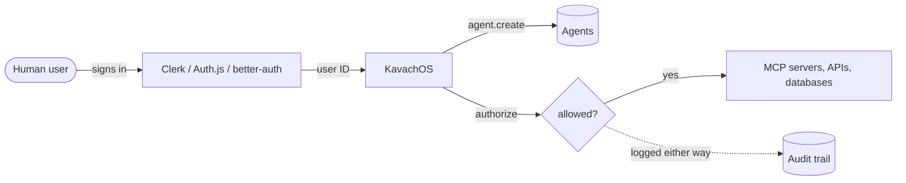

**Auth for AI agents.** KavachOS gives every agent its own identity, checks permissions at call time, and writes an audit row for every decision. Plugs in after your human auth (Clerk, Auth.js, better-auth, or your own). Runs on Node, edge, Workers, Deno, and Bun.

<CardGroup cols={2}>
  <Card title="Quickstart" icon="rocket" href="/quickstart">
    Agent in five minutes.
  </Card>
  <Card title="npm install" icon="terminal" href="/quickstart">
    `npm i kavachos`
  </Card>
</CardGroup>

```ts
import { createKavach } from 'kavachos';

const kavach = await createKavach({
  database: { provider: 'sqlite', url: 'kavach.db' },
});

const agent = await kavach.agent.create({
  ownerId: user.id,
  name: 'code-reviewer',
  type: 'autonomous',
  permissions: [
    { resource: 'mcp:github:*', actions: ['read'] },
  ],
});

const { allowed, auditId } = await kavach.authorize(agent.id, {
  action: 'read',
  resource: 'mcp:github:repos',
});
```

## What's in the box

<Columns cols={3}>
<div>
**Agent identity** as a first-class entity, not an extension of a user.
</div>
<div>
**Resource wildcards** with rate limits, time windows, and IP allowlists.
</div>
<div>
**Delegation chains** with depth, expiry, and cascading revocation.
</div>
<div>
**Append-only audit** with JSON and CSV export.
</div>
<div>
**MCP OAuth 2.1** authorization server, PKCE and DCR built in.
</div>
<div>
**Trust scoring** per agent with anomaly detection and budget caps.
</div>
<div>
**Ten adapters** for Node, edge, Workers, Deno, Bun.
</div>
<div>
**Four databases**: SQLite, Postgres, MySQL, Cloudflare D1.
</div>
<div>
**Web Crypto only** in core, no Node-specific APIs.
</div>
</Columns>

## How it fits with your stack



<Info>
KavachOS does not replace your human auth. It does not handle login forms, password resets, or social OAuth for users. It starts where human auth ends, at the point your product spins up an agent to act on a user's behalf.
</Info>

## Pick your framework

<CardGroup cols={4}>
  <Card title="Next.js" icon="/brand-icons/nextdotjs.svg" href="/adapters/nextjs">
    App Router and Pages.
  </Card>
  <Card title="Hono" icon="/brand-icons/hono.svg" href="/adapters/hono">
    Workers, Deno, Bun.
  </Card>
  <Card title="Express" icon="/brand-icons/express.svg" href="/adapters/express">
    Classic Node handlers.
  </Card>
  <Card title="Fastify" icon="/brand-icons/fastify.svg" href="/adapters/fastify">
    Plugins and decorators.
  </Card>
  <Card title="NestJS" icon="/brand-icons/nestjs.svg" href="/adapters/nestjs">
    Guards and decorators.
  </Card>
  <Card title="Nuxt" icon="/brand-icons/nuxt.svg" href="/adapters/nuxt">
    Server routes.
  </Card>
  <Card title="SvelteKit" icon="/brand-icons/svelte.svg" href="/adapters/sveltekit">
    Hooks and endpoints.
  </Card>
  <Card title="Astro" icon="/brand-icons/astro.svg" href="/adapters/astro">
    Server islands.
  </Card>
</CardGroup>

## The six primitives

<CardGroup cols={2}>
  <Card title="Agent identity" icon="robot" href="/agents">
    Bearer tokens (`kv_...`), rotation, expiry. SHA-256 hashed at rest.
  </Card>
  <Card title="Permission engine" icon="shield-halved" href="/permissions">
    Resource wildcards, rate limits, time windows, IP allowlists, approval gates.
  </Card>
  <Card title="Delegation" icon="link" href="/delegation">
    Orchestrator delegates a subset to a sub-agent with depth and expiry. Revocation cascades.
  </Card>
  <Card title="Audit trail" icon="scroll" href="/audit">
    Every `authorize()` writes agent, user, resource, action, result, duration.
  </Card>
  <Card title="MCP OAuth 2.1" icon="globe" href="/mcp">
    Spec-compliant AS with PKCE S256, RFC 9728, RFC 7591.
  </Card>
  <Card title="Trust scoring" icon="chart-line" href="/trust">
    Nine-factor score per agent. Anomaly detection and budget policies on top.
  </Card>
</CardGroup>

## Switching from another auth library

<CardGroup cols={2}>
  <Card title="From better-auth" icon="arrow-right" href="/migrate/from-better-auth">
    Concepts map, code diffs, data migration SQL.
  </Card>
  <Card title="From Clerk" icon="arrow-right" href="/migrate/from-clerk">
    Hooks, middleware, Clerk data export, rollout plan.
  </Card>
</CardGroup>

<Tip>
New releases land on [GitHub](https://github.com/kavachos/kavachos/releases) every week or two. Watch the repo or follow [@thegdsks](https://x.com/thegdsks) for the highlights.
</Tip>
