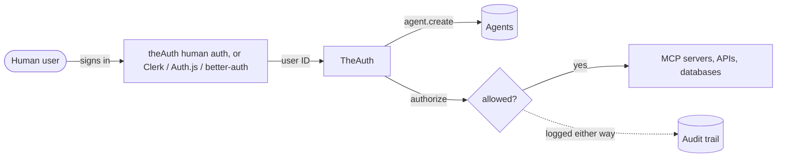

**Auth where AI agents get their own identity, limited permissions and an audit trail, next to normal human sign in.** theAuth gives every agent its own token, checks permissions at call time and writes an audit row for every decision. It also ships human auth: 14 methods (email and password, magic link, passkeys, TOTP and more) and 17 OAuth providers. Use either half alone, or both. Runs on Node, Bun, Deno and Cloudflare Workers.

<Note>Building in Go? See the [theAuth Go library docs](/go/getting-started/overview).</Note>

## Pick your track

<CardGroup cols={2}>
  <Card title="Add agent auth" icon="robot" href="/quickstart#track-a-add-agent-auth">
    Give agents an identity, scoped permissions, delegation and an audit trail. About five minutes.
  </Card>
  <Card title="Add human auth" icon="user" href="/quickstart#track-b-add-human-auth">
    Sign-up, sign-in, verification and reset with email and password, then add passkeys, OAuth and more. About five minutes.
  </Card>
</CardGroup>

### Agent auth in one screen

```ts
import { createTheAuth, users } from '@glinr/theauth';

const theauth = await createTheAuth({
  database: { provider: 'sqlite', url: ':memory:' },
});

// The owner must exist in theauth_users (human auth creates these for you).
theauth.db.insert(users).values({
  id: 'user-123', email: 'owner@example.com', name: 'Owner',
  createdAt: new Date(), updatedAt: new Date(),
}).run();

const agent = await theauth.agent.create({
  ownerId: 'user-123',
  name: 'code-reviewer',
  type: 'autonomous',
  permissions: [{ resource: 'mcp:github:*', actions: ['read'] }],
});

const { allowed, auditId } = await theauth.authorize(agent.id, {
  action: 'read',
  resource: 'mcp:github:repos',
});
```

### Human auth in one screen

```ts
import { createTheAuth } from '@glinr/theauth';
import { emailPassword } from '@glinr/theauth-email';

const theauth = await createTheAuth({
  database: { provider: 'sqlite', url: ':memory:' },
  plugins: [
    emailPassword({
      appUrl: 'http://localhost:3000',
      sendVerificationEmail: async (email, _token, url) => console.log(email, url),
      sendResetEmail: async (email, _token, url) => console.log(email, url),
    }),
  ],
});

// POST /auth/sign-up, /auth/sign-in, /auth/verify-email, /auth/request-reset ...
const res = await theauth.plugins.handleRequest(request);
```

## What's in the box

<Columns cols={3}>
<div>
**Agent identity** as a first-class entity, not an extension of a user.
</div>
<div>
**Resource wildcards** with rate limits, time windows, and IP allowlists.
</div>
<div>
**Delegation chains** with depth, expiry, and cascading revocation.
</div>
<div>
**Audit log** of every decision, with JSON and CSV export.
</div>
<div>
**MCP OAuth 2.1** authorization server, PKCE and DCR built in.
</div>
<div>
**Trust scoring** per agent from audit history, plus budget policies.
</div>
<div>
**Ten adapters** for Node, edge, Workers, Deno, Bun.
</div>
<div>
**Four databases**: SQLite, Postgres, MySQL, Cloudflare D1.
</div>
<div>
**Web Crypto only** in core, no Node-specific APIs.
</div>
</Columns>

## How it fits with your stack


```mermaid
flowchart LR
  User([Human user]) -->|signs in| HumanAuth[theAuth human auth, or Clerk / Auth.js / better-auth]
  HumanAuth -->|user ID| TheAuth[TheAuth]
  TheAuth -->|agent.create| Agents[(Agents)]
  TheAuth -->|authorize| Decision{allowed?}
  Decision -->|yes| Tools[MCP servers, APIs, databases]
  Decision -.->|logged either way| Audit[(Audit trail)]
```

<Info>
theAuth includes human auth, but you do not have to use it. If you already run Clerk, Auth.js, better-auth or your own login, keep it and pass the user ID as the agent's owner. theAuth's own methods (see [Authentication](/auth)) cover sign-in forms, password reset and social OAuth when you want one library for both.
</Info>

<Frame caption="theAuth runs inside your own app and infrastructure, with your own database.">
  
</Frame>

## Pick your framework

<CardGroup cols={4}>
  <Card title="Next.js" icon="/brand-icons/nextdotjs.svg" href="/adapters/nextjs">
    App Router and Pages.
  </Card>
  <Card title="Hono" icon="/brand-icons/hono.svg" href="/adapters/hono">
    Workers, Deno, Bun.
  </Card>
  <Card title="Express" icon="/brand-icons/express.svg" href="/adapters/express">
    Classic Node handlers.
  </Card>
  <Card title="Fastify" icon="/brand-icons/fastify.svg" href="/adapters/fastify">
    Plugins and decorators.
  </Card>
  <Card title="NestJS" icon="/brand-icons/nestjs.svg" href="/adapters/nestjs">
    Guards and decorators.
  </Card>
  <Card title="Nuxt" icon="/brand-icons/nuxt.svg" href="/adapters/nuxt">
    Server routes.
  </Card>
  <Card title="SvelteKit" icon="/brand-icons/svelte.svg" href="/adapters/sveltekit">
    Hooks and endpoints.
  </Card>
  <Card title="Astro" icon="/brand-icons/astro.svg" href="/adapters/astro">
    Server islands.
  </Card>
</CardGroup>

## The six primitives

<CardGroup cols={2}>
  <Card title="Agent identity" icon="robot" href="/agents">
    Bearer tokens (`kv_...`, a prefix kept from before the rename), rotation, expiry. SHA-256 hashed at rest.
  </Card>
  <Card title="Permission engine" icon="shield-halved" href="/permissions">
    Resource wildcards, rate limits, time windows, IP allowlists, approval gates.
  </Card>
  <Card title="Delegation" icon="link" href="/delegation">
    Orchestrator delegates a subset to a sub-agent with depth and expiry. Revocation cascades.
  </Card>
  <Card title="Audit trail" icon="scroll" href="/audit">
    Every `authorize()` writes agent, user, resource, action, result, duration.
  </Card>
  <Card title="MCP OAuth 2.1" icon="globe" href="/mcp">
    Spec-compliant AS with PKCE S256, RFC 9728, RFC 7591.
  </Card>
  <Card title="Trust scoring" icon="chart-line" href="/trust">
    Score per agent computed from audit history. Budget policies you check and record yourself.
  </Card>
</CardGroup>

## Switching from another auth library

<CardGroup cols={2}>
  <Card title="From better-auth" icon="arrow-right" href="/migrate/from-better-auth">
    Concepts map, code diffs, data migration SQL.
  </Card>
  <Card title="From Clerk" icon="arrow-right" href="/migrate/from-clerk">
    Hooks, middleware, Clerk data export, rollout plan.
  </Card>
</CardGroup>

<Tip>
New releases land on [GitHub](https://github.com/glincker/theauth/releases) every week or two. Watch the repo or follow [@thegdsks](https://x.com/thegdsks) for the highlights.
</Tip>

## Related

<CardGroup cols={2}>
  <Card title="Core concepts" href="/concepts" icon="lightbulb">
    The mental model for agents, permissions, delegation, and audit.
  </Card>
  <Card title="MCP OAuth 2.1" href="/mcp" icon="globe">
    Spec-compliant authorization server for Model Context Protocol tool servers.
  </Card>
  <Card title="Database setup" href="/database" icon="database">
    SQLite, Postgres, MySQL, and Cloudflare D1 configuration.
  </Card>
  <Card title="Standards alignment" href="/standards" icon="book-open">
    IETF draft claims theAuth tracks and emits on agent JWTs.
  </Card>
</CardGroup>
